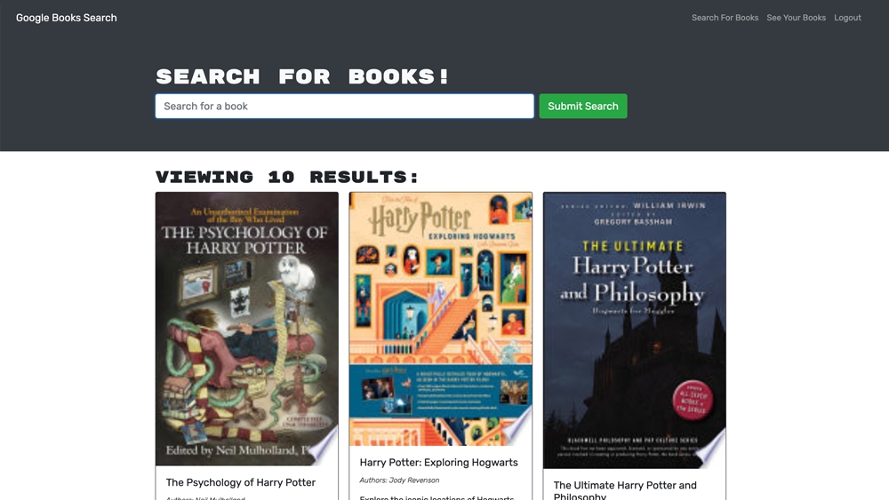

# Book Search Engine

## Description
Refactored a Google Books API search engine built with a RESTful API into a GraphQL API built with Apollo Server. App uses the MERN stack: React front end, MongoDB databse, and Node/Express server and API. 

## Deployed App

## Table of Contents
- [Usage](#usage)
- [Screenshot](#screenshot)
- [License](#license)
- [Questions](#questions)
  
## Usage
Visit the url of the deployed app. Sign up or log in. Search for a book or keywords, and save books to your list. Then, view saved books with the link at the top.
  
## Screenshot

## License
Learn more about [MIT](https://choosealicense.com/licenses/mit/).
  
## Questions
GitHub Username: aberger3647

You can reach me with any questions at aberger3647@gmail.com
